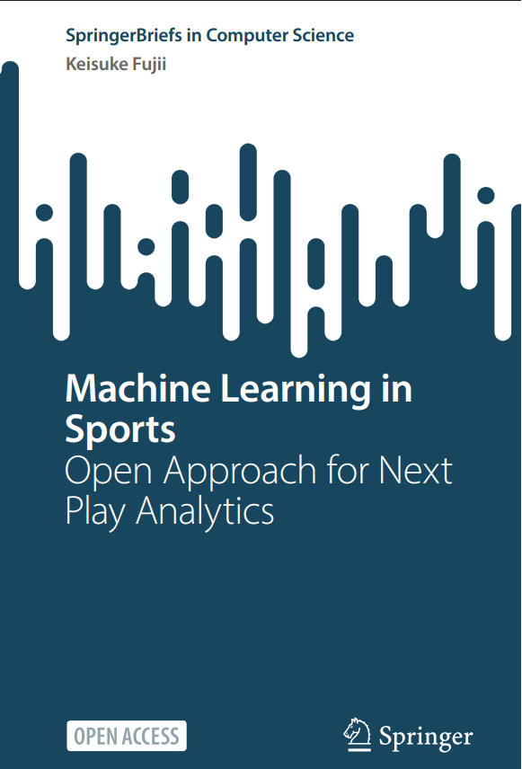

  

# ML-in-Sports-KeisukeFujii
This repo contains the publicly available papers and articles cited in the "Machine Learning in Sports: Open Approach for Next Play Analytics" by Keisuke Fujii as part of the SpringerBriefs in Computer Science.
[Machine Leraning in Sports]([https://example.com](https://doi.org/10.1007/978-981-96-1445-5))
The purpose of this repo is to serv as a complimentary resource for ease of access when you're reading the book.
Please contact me know if you're one of the authors and want your papers' likns removed. 
Please give this repo a star if you found it helpful!

# About this book
This open access book provides cutting-edge work on machine learning in sports analytics, emphasizing the integration of computer vision, data analytics, and machine learning to redefine strategic sports analysis. This book not only covers the essential methodologies of capturing and analyzing real sports data but also pioneers the integration of real-world analytics with digital modeling, advancing the field toward sophisticated digital modeling in sports.

Through a seamless blend of theoretical frameworks and practical applications, the book illustrates how these integrated technologies can be utilized to predict, evaluate, and suggest next plays in sports. By leveraging the power of machine learning, the book presents cutting-edge approaches to sports analytics, where data from actual games is enhanced with predictive simulations for strategic planning and decision-making. The use of digital modeling in sports opens up new dimensions of interaction between the physical play and its digital analysis, offering a comprehensive understanding that was previously unattainable.

This book is an essential read for postgraduates, researchers, and technologists, who are interested in sports analysts. The book consists of five parts: Part I, which comprises a single chapter exploring the fundamentals and scope of learning-based sports analytics; Parts II, III, IV, and V review the various aspects of this field, including data acquisition with computer vision, predictive analysis and play evaluation with machine learning, potential play evaluation with learning-based agent modeling, and future perspectives and ecosystems on the field. This structure provides a comprehensive overview that will engage and inform researchers and practitioners interested in the intersection of analytical research and cutting-edge technology in sports.

# Keywords
Open Access,
Artificial intelligence,
Machine learning,
Deep learning,
Real-world data,
Prediction,
Reinforcement learning,
Cyber-physical systems,
Modeling,
Sports,
Football,
Soccer,
Basketball

# Table of contents (5 chapters)
1- [What is Learning-Based Sports Analytics?](1-What is Learning-Based Sports Analytics)  
2- [Computer Vision for Sports Analytics](2-Computer Vision for Sports Analytics)  
3- [Predictive Analysis and Play Evaluation with Machine Learning](3-Predictive Analysis and Play Evaluation with Machine Learning)  
4- [Potential Play Evaluation with Learning-Based Agent Modeling](4-Potential Play Evaluation with Learning-Based Agent Modeling)  
5- [Future Perspectives and Ecosystems](5-Future Perspectives and Ecosystems)
